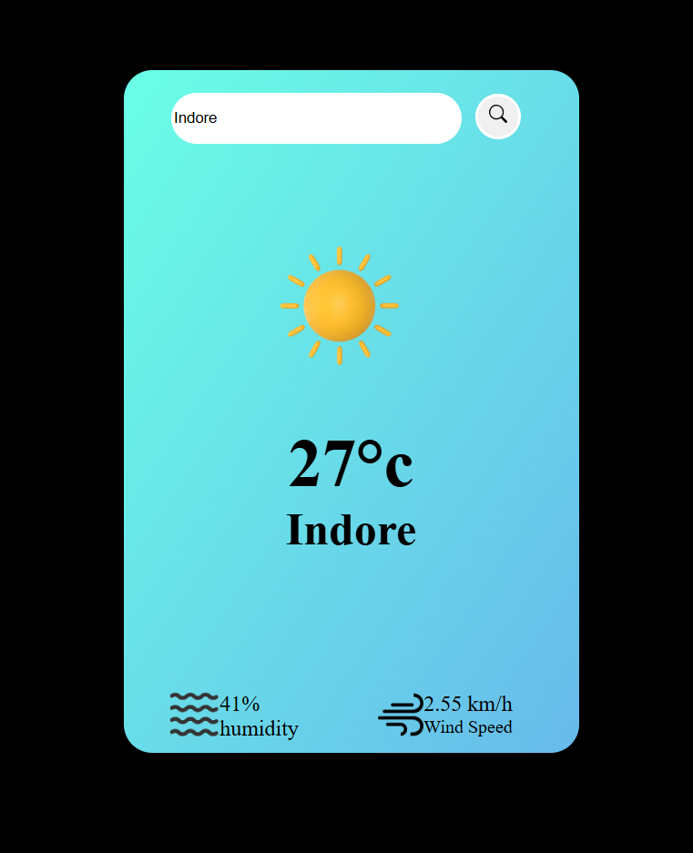

# Weather-Vision
A real-time weather app that **fetches real-time weather data using the OpenWeatherMap API** to check current temperature, humidity, wind speed, and weather conditions for any city 

## 🚀 Features

  - 🌍 Search weather by city name
  - 🌡️ Displays temperature (°C), humidity (%), and wind speed (km/h)
  - ⛅ Dynamic weather icons for Clouds, Clear, Rain, Drizzle, and Mist
  - ⚠️ Error handling for invalid city names
  - 💻 Clean, responsive, and user-friendly UI

  ## 📸 Project UI

## 🧠 Technologies Used

  - **HTML5** – Structure of the web app 
  - **CSS3** – Styling and layout
  - **JavaScript (ES6)** – Dynamic functionality and API handling
  - **OpenWeatherMap API** – Real-time weather data source

## 📁 Project Structure / Code Files

- `index.html` → Main HTML file for the UI
- `style.css` → CSS file for styling the app
- `index.js` → JavaScript file for fetching weather data and updating the UI
- `images/` → Folder containing weather icons and screenshot

